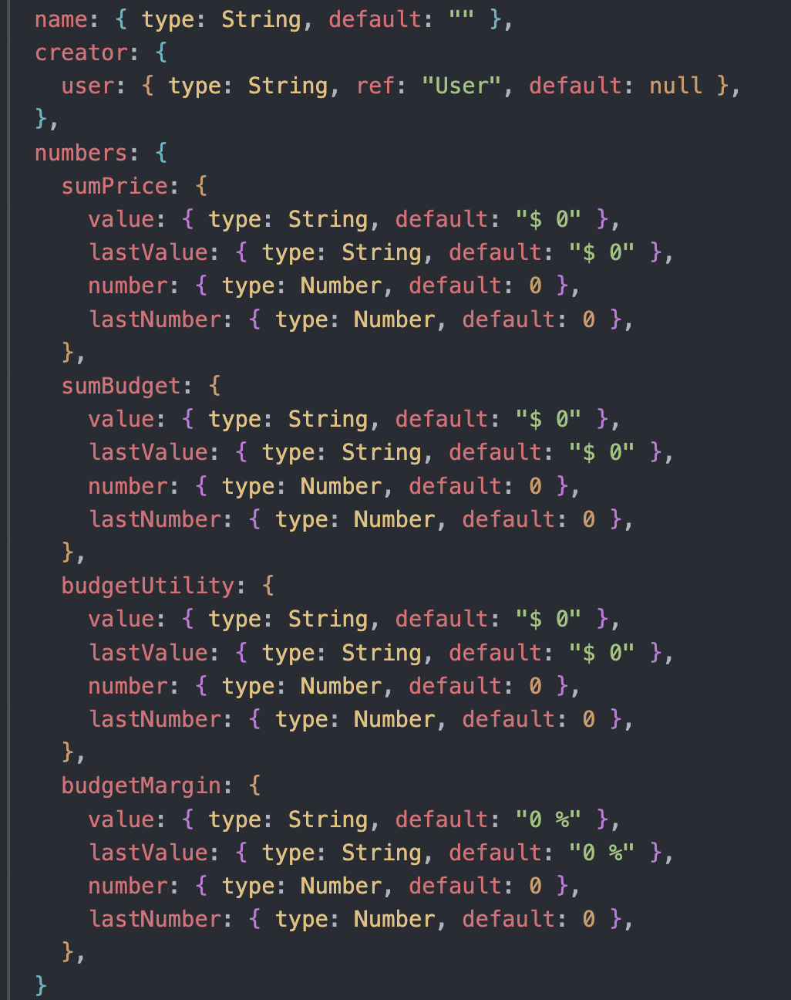

# Test - UNABASE

# Prueba Técnica Back-End

## Objetivo

Desarrollar una api con express y mongoose que permita realizar las siguientes tareas:

-   Crear un modelo de usuario con campos, de email, contraseña y nombre que permita al usuario hacer login y registrarse.
-   Crear modelo y endpoints de lineas, movimientos y proyectos, que permitan realizar cálculos de totales para cada registro.

---

## Criterios de Desarrollo

### **Tecnologías y Herramientas**

-   Libería: Express, JsonWebToken, mongoose.

---

### Tarea 1: Registrar y validar usuarios con middleware

Se deben crear 2 endpoints para esta sección

-   Endpoint de registro de usuario: Debe pedir datos de nombre contraseña e email. El email es una llave única para el modelo.
-   Endpoint de login de usuario que permita al usuario hacer login con usuario y contraseña.

Ambos endpoints deben entregar como salida un token que permita validar a esos usuarios para las siguientes rutas de la tarea 2.

-   Middleware que permita leer un token de usuarios validados para acceder a las siguientes rutas.

---

### Tarea 2: Creación de registros de proyectos, movimientos, lineas.

Cada una de estas definiciones corresponden a un modelo diferente, es decir, existe el modelo de proyectos, modelo de movimientos y modelo de lineas que tendrán este formato:

Donde: name es el nombre, creator el creador y en numbers existen los campos para precio de venta(sumPrice), precio Presupuestado (sumBudget), Utilidad Presupuestada (budgetUtility) y Margen Presupuestado (budgetMargin)

-   Estos endpoints deben utilizar el middleware creado anteriormente para que solo puedan ser utilizado por usuarios registrados.

### Endpoints de Proyectos:

-   Endpoint que permita a un usuario validado crear un proyecto
-   Endpoint que permita a un usuario validado obtener todos sus proyectos
-   Endpoint que permita a un usuario validado eliminar 1 o mas proyectos

### Endpoints de Movimientos:

-   Endpoint que permita a un usuario validado crear un movimientos dentro de un proyecto
-   Endpoint que permita a un usuario validado obtener todos los movimientos de un proyectos
-   Endpoint que permita a un usuario validado eliminar 1 o mas movimientos

### Endpoints de Lineas:

-   Endpoint que permita a un usuario validado crear un lineas dentro de un movimientos
-   Endpoint que permita a un usuario validado obtener todas las lineas de un movimientos
-   Endpoint que permita a un usuario validado eliminar 1 o mas lineas

### Cálculos en lineas:

-   Endpoint que permita a un usuario cambiar el valor sumPrice.number o sumbudget.number en una linea, esto deberá:
    -   Actualizar los valores .value con un formato de monetario adecuado
    -   Actualizar los valores de numbers para utilidad presupuestada y margen presupuestado en la linea
    -   Actualizar de la misma forma los valores de numbers para el movimiento asociado
    -   Actualizar de la misma forma los valores de numbers para el proyecto asociado

### Ruta de buscador de elementos:

-   Endpoint que permita a un usuario encontrar coincidencias por nombre de proyectos. Debe tener inteligencia para encontrar la mejor respuesta. debe utilizarse función de Paginate.

---

## Consideraciones Finales

-   Se prioriza el **código limpio y reutilizable**.
-   La implementación del **diseño es libre**, pero debe ser clara y usable.
-   Todo valor extra al ejercicio será considerado (validaciones extra, manejo de errores, etc)

---

¡Buena suerte con la prueba! 🚀
